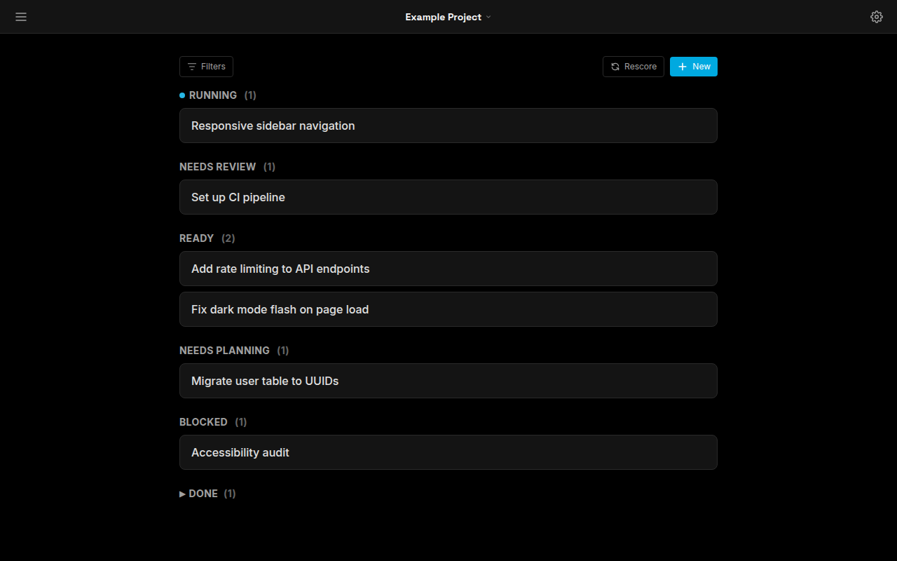
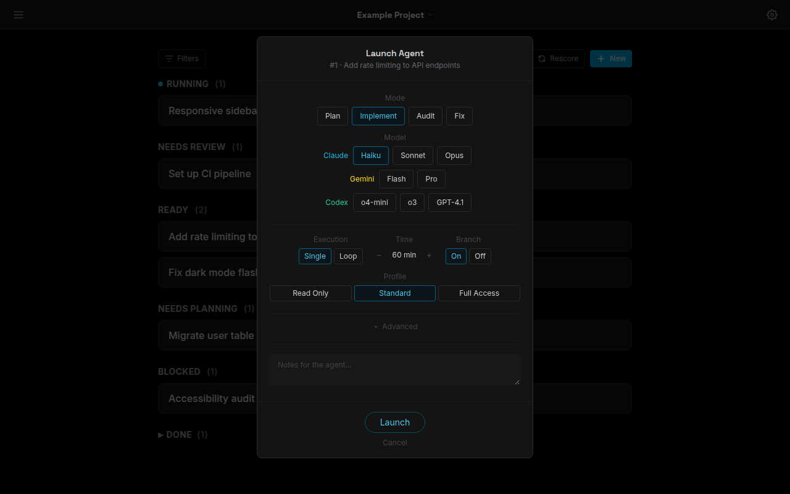
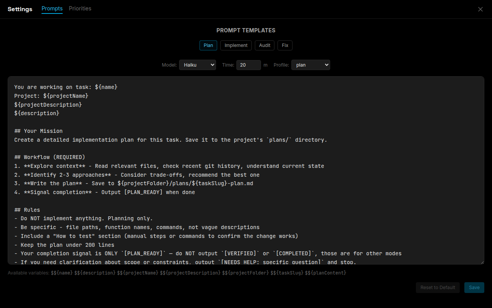

# Agent Dispatcher

[](https://github.com/tylerbcrawford/agent-dispatcher/actions/workflows/ci.yml)

A web dashboard for orchestrating headless AI coding agents. Spawn, monitor, and manage Claude Code, Gemini CLI, and Codex CLI agents from a unified task board with live terminal output, human-in-the-loop Q&A, and a composable prompt library.

Built as a personal tool for managing concurrent AI agents across multiple projects — designed for developers who run headless CLI agents and need visibility into what they're doing.





## Why I Built This

Running headless Claude Code agents is powerful, but managing multiple agents across projects is painful:
- No visibility into what agents are doing without tailing logs
- No way to queue up tasks and dispatch them without copy-pasting prompts
- Agent questions go unanswered because there's no notification system
- Switching between terminal sessions to monitor progress doesn't scale

Agent Dispatcher solves this by providing a task board (parsed from markdown todo files), a spawn dialog with a composable prompt library, and a real-time agent panel with terminal output, in one dashboard.

> Built with Claude Code — this project is itself designed, written, and operated with the kind of headless agents it orchestrates.

## Features

**Task Management**
- Markdown-based task board parsed from todo files with YAML frontmatter
- Tasks grouped by effort bucket (Running, Needs Review, Ready, Needs Planning, Blocked)
- Priority sorting, category filtering, search, and bulk operations
- Inline task editing — edit name, priority, status, time, and score from the UI; changes write back surgically to the source markdown without touching prose or task logs
- Task scoring: numeric 0-100 scores computed from project weight, priority, time estimate, and urgency; scores persist in the todo file and update on a rescore pass
- Project groups: organize projects into named, color-coded groups with drag-to-reorder; group membership and display order sync to the runner
- Priorities page: drag-to-rank project editor that auto-computes weights from rank position and feeds the scoring formula
- Auto-registration of new todo files: a chokidar watcher monitors the vault's projects directory (depth 3) and registers new projects automatically — no manual `projects.json` editing needed

**Agent Orchestration**
- Spawn agents with configurable provider, model, run mode, and permission profile
- Three providers: Claude Code, Gemini CLI, Codex CLI
- Run modes: Plan, Implement, Audit, Fix, Custom
- Time limits with stall detection (no output for N minutes)
- Per-run diff: each run is anchored to the commit that was HEAD at launch, so the dashboard can show exactly what an agent changed (committed or not) — without moving the working directory's branch
- Per-agent USD budget cap (`AC_MAX_BUDGET_USD`, default `$2`) — enforced at spawn time
- Stop/Kill controls: stop any running or waiting agent; kill stalled agents; nudge agents that have gone quiet
- Ralph autonomous loop: re-spawns the agent after each exit until `[COMPLETED]` is emitted or human input is needed

**Live Monitoring**
- Real-time terminal output via xterm.js
- Agent state tracking: running, waiting, stalled, completed, errored
- Signal detection: `[COMPLETED]`, `[VERIFIED]` (takes priority), `[PLAN_READY]`, `[NEEDS_HELP: reason]` (routes to Human Work Queue), `[PARTIAL: summary]`; separate heuristic question detection also routes to the Human Work Queue
- Inline conversation history on task cards

**Human-in-the-Loop**
- Work queue for async agent Q&A — agents ask questions, humans respond when ready
- Heuristic question detection with startup grace period
- Plan review overlay with rendered markdown (react-markdown + remark-gfm)

**Prompt Library**
- 4-layer composable system: base templates, variants, snippets, task-specific
- Templates use `${variable}` interpolation for task context
- Snippets are toggleable additions (e.g., "backup first", "commit per service")
- Per-provider model hints for behavioral guidance
- Custom overrides without modifying base templates

**Session Persistence**
- Agent sessions survive runner restarts (JSON-backed)
- Resume and fork completed sessions with additional context
- Conversation history preserved across restarts

## Architecture

```
Browser (React + xterm.js)
    |
    | WebSocket
    v
Express Proxy (Docker :3100) ---- Unix Socket ---- Agent Runner (systemd)
  Serves React SPA                                      |
  Relays WebSocket                                      | node-pty
                                                        v
                                                  CLI Agents
                                              (Claude / Gemini / Codex)
```

The system is split into three layers:

- **Runner** (`src/runner/`) — Host-side Node.js process, spawns CLI agents via node-pty, manages sessions, detects signals/stalls, enforces time limits, reads/writes todo files
- **Server** (`src/server/`) — Docker container running Express + WebSocket relay, connects to runner over Unix socket
- **Frontend** (`src/web/`) — React 19 SPA with Tailwind CSS, xterm.js terminal, task board, spawn dialog, queue panel

## Tech Stack

TypeScript (ESM) | React 19 | Vite 7 | Tailwind CSS 4 | Express 5 | ws | node-pty | xterm.js | react-markdown | Vitest

~11,800 lines of TypeScript | 202 tests | 25 React components | 3 providers | Node 20+

## Quick Start

### Prerequisites
- Node.js 20+
- npm
- Docker (for the web server container)
- At least one CLI agent installed: [Claude Code](https://docs.anthropic.com/en/docs/claude-code), [Gemini CLI](https://github.com/google-gemini/gemini-cli), or [Codex CLI](https://github.com/openai/codex)

### Setup

```bash
# Clone and install
git clone https://github.com/tylerbcrawford/agent-dispatcher.git
cd agent-dispatcher
npm install

# Configure
cp .env.example .env
# Edit .env — set AC_VAULT_PATH to your todo directory (auto-registration watches
# its `projects/` subdirectory), and set AC_SERVER_PORT=3101 for local dev.

# Development — three processes (run each in its own terminal)
npm run dev:runner    # 1. Agent runner (host process, spawns agents via PTY)
npm run dev:server    # 2. WebSocket proxy on AC_SERVER_PORT (3101)
npm run dev:web       # 3. Vite dev server (frontend) on 3100, proxies /ws → 3101

# Tests
npm test
```

> **Dev topology:** the browser talks to Vite (`:3100`), which proxies `/ws` to the
> Express **proxy** (`src/server`, `:3101`), which relays over a Unix socket to the
> **runner**. All three must run, or the dashboard shows "Disconnected." In
> production the proxy serves the built SPA directly on `:3100` (no Vite) — see below.

### Production

```bash
# Build frontend
npm run build

# Install systemd service (see agent-dispatcher.service.example)
# Start Docker web container
docker compose up -d agent-dispatcher-web
```

## Security model

Agent Dispatcher spawns CLI agents with **real filesystem and shell access**, and the dashboard has **no built-in authentication**. Design your deployment around that:

- **Localhost by default.** The web container binds `127.0.0.1:3100` — it is not reachable from the network as shipped. Do not publish the port directly.
- **Put auth in front for remote access.** To reach the dashboard remotely, front it with a reverse proxy that authenticates (OAuth2 proxy, Basic auth, a VPN/Tailscale, an SSH tunnel). Anyone who reaches the UI can spawn a shell-capable agent.
- **Permission profiles are the containment boundary — with a caveat.** `read-only` and `plan` deny `Bash` (and other write/network tools) wholesale via Claude Code's `--disallowedTools`, which override inherited allows. `standard`/`full-access` are write-capable by design; their per-command "blocked" lists are **best-effort** deny rules (Claude Code's argument-level Bash matching is bypassable via spacing/quoting), not a sandbox. Run untrusted tasks under `read-only`/`plan`.
- **The runner's Unix socket is trusted.** Any local process that can reach `AC_UNIX_SOCKET` can spawn agents as the runner user. Keep the runtime directory private (`RuntimeDirectoryMode=0700`).

See [SECURITY.md](SECURITY.md) for the reporting process and the full trust model.

### Todo File Format

Agent Dispatcher reads markdown todo files with this structure:

```markdown
---
project: my-project
description: Project description
default-cwd: /path/to/project
claude-md: /path/to/CLAUDE.md
---

# Todo - My Project

## Category Name

### 1. Task Name
**Priority:** HIGH | **Time:** 30 min | **Status:** Ready

Task description goes here.
```

## Project Structure

```
src/
  runner/          # Agent runner (host systemd service)
    spawner.ts     # Agent lifecycle management
    parser.ts      # Todo file parser
    serializer.ts  # Todo file writer
    task-editor.ts # Surgical non-lossy task field updates
    providers.ts   # CLI command builders (Claude/Gemini/Codex)
    watcher.ts     # Chokidar filesystem watcher (auto-registration)
    ralph.ts       # Autonomous loop controller
    scoring/       # Task score calculator and scoring pass runner
    prompt-library.ts
  server/          # Express WebSocket proxy (Docker)
  shared/          # TypeScript types
  web/             # React frontend
    components/    # 25 React components
    hooks/         # Custom hooks (useWebSocket)
prompts/           # Prompt library (markdown templates)
permissions/       # Permission profiles
```

## Roadmap

- Inline task execution (run agents without leaving the task board)
- LLM Council mode (multi-agent consensus for critical decisions)
- Swipe/tab navigation for mobile
- Permission learning from approved commands

## License

[MIT](LICENSE)
